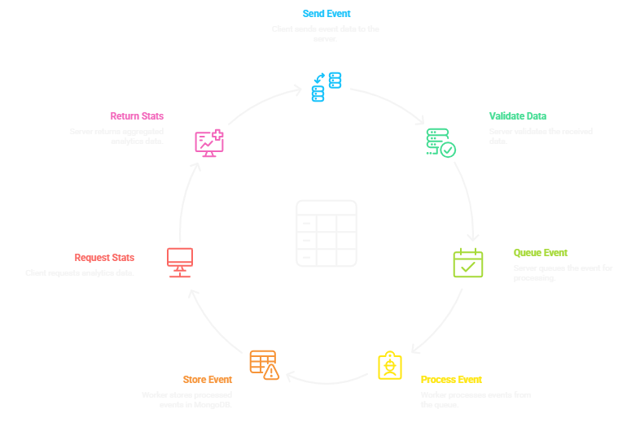

# Analytics Service

A high-performance website analytics service built with **Node.js**, **Express**, **Redis**, and **MongoDB**. Designed for **high-volume event ingestion** with **sub-5ms response times** and fast analytics aggregation.

---

## Architecture Decision



### Asynchronous Processing with Redis Queue

#### **Why We Chose Redis for the Queue**

Think of Redis like a super-fast **waiting room** for events:

* **Lightning Fast**: Redis stores data in memory (RAM), which is 100x faster than writing to a hard disk
* **Never Loses Data**: Even if the server restarts, your events are safe
* **Easy to Scale**: You can add more workers to process events faster, like having multiple cashiers at a grocery store
* **Simple to Use**: Just two commands - add to line (`RPUSH`) and take from line (`LPOP`)

#### **How the System Works -**

Imagine a busy restaurant:

1. **Host (Ingestion API)**: 
   - You walk in and tell the host you want a table
   - The host immediately gives you a ticket and says "We'll call you when ready" 
   - You get instant response - no waiting!

2. **Kitchen Staff (Worker Service)**:
   - Every 2 seconds, the kitchen checks the waiting list
   - They prepare food (process events) and serve customers (save to database)
   - This happens in the background - you don't wait for it

3. **Manager (Reporting API)**:
   - Looks at all the served customers in the record book (MongoDB)
   - Tells you how many people visited, popular dishes, etc.

4. **Key Benefit**: The host never makes you wait for the kitchen. You get immediate service!

#### **Why This is Better**

* **Instant Responses**: Your website gets "success" in under 5ms, even during traffic spikes
* **Never Lose Data**: Events are safely stored in Redis until processed
* **Grow Easily**: Add more kitchen staff (workers) when you get busier
* **Always Know What's Happening**: Built-in monitoring shows queue status and system health

#### **Real-World Example**

**Without Redis (Slow Way):**
```
Customer → "I want a table" → Waits for kitchen to cook → Gets response after 2 seconds
```

**With Redis (Fast Way):**
```
Customer → "I want a table" → Gets ticket immediately → Kitchen cooks later
Response: 3ms instead of 2000ms!
```

This is why we chose Redis - it makes our analytics service **blazing fast** while keeping your data **completely safe**.

## 🗄 Database Schema

### **Events Collection**

```javascript
{
  site_id: String,
  event_type: String, 
  path: String,
  user_id: String,
  timestamp: Date,
  createdAt: Date,
  updatedAt: Date
}
```

### **Optimized Indexes**

* `site_id`
* `timestamp`
* `user_id`
* `{ site_id: 1, timestamp: 1 }`
* `{ site_id: 1, event_type: 1 }`

---

## Setup Instructions

### **Prerequisites**

* Node.js 16+
* Redis
* MongoDB

---

### **1️ Install Dependencies**

```bash
git clone <repository-url>
cd analytics-service
npm install
```

---

### **2️ Start Redis & MongoDB**

#### **macOS**

```bash
brew install redis
brew services start redis

brew tap mongodb/brew
brew install mongodb-community
brew services start mongodb-community
```

#### **Ubuntu/Linux**

```bash
sudo apt update
sudo apt install redis-server
sudo systemctl start redis

wget -qO - https://www.mongodb.org/static/pgp/server-6.0.asc | sudo apt-key add -
echo "deb [ arch=amd64,arm64 ] https://repo.mongodb.org/apt/ubuntu focal/mongodb-org-6.0 multiverse" | sudo tee /etc/apt/sources.list.d/mongodb-org-6.0.list
sudo apt-get update
sudo apt-get install -y mongodb-org
sudo systemctl start mongod
```

#### **Windows**

* Redis: [https://github.com/microsoftarchive/redis/releases](https://github.com/microsoftarchive/redis/releases)
* MongoDB: [https://www.mongodb.com/try/download/community](https://www.mongodb.com/try/download/community)

---

### **3️ Verify Services**

```bash
redis-cli ping     # PONG
mongosh --eval "db.adminCommand('ismaster')"
```

---

### **4️ Start the Analytics Service**

```bash
npm run dev   # Development
npm start     # Production
```

**Expected Output**

```
Starting Analytics Service with Redis...
Initializing database connections...
Successfully connected to Redis
Connected to MongoDB
All database connections established!
Background queue processor started
Analytics Service running on port 3000
```

---

## API Usage

---

### **POST /event – Ingest Event (FAST)**

#### **cURL**

```bash
curl -X POST http://localhost:3000/event \
  -H "Content-Type: application/json" \
  -d '{
    "site_id": "site-abc-123",
    "event_type": "page_view",
    "path": "/pricing",
    "user_id": "user-xyz-789",
    "timestamp": "2025-11-12T19:30:01Z"
  }'
```

#### **PowerShell**

```powershell
$body = @{
    site_id = "site-abc-123"
    event_type = "page_view"
    path = "/pricing"
    user_id = "user-xyz-789"
    timestamp = "2025-11-12T19:30:01Z"
} | ConvertTo-Json

Invoke-RestMethod -Uri "http://localhost:3000/event" -Method POST -Headers @{"Content-Type" = "application/json"} -Body $body
```

#### **Example Response**

```json
{
  "status": "success",
  "message": "Event queued for processing",
  "event_id": "a1b2c3d4-e5f6-7890-abcd-ef1234567890",
  "queue_time": "3ms",
  "queue_length": 5
}
```

---

### **GET /stats – Fetch Analytics**

```bash
curl "http://localhost:3000/stats?site_id=site-abc-123&date=2025-11-12"
```

**Example Response**

```json
{
  "site_id": "site-abc-123",
  "date": "2025-11-12",
  "total_views": 1450,
  "unique_users": 212,
  "top_paths": [
    {"path": "/pricing", "views": 700},
    {"path": "/blog/post-1", "views": 500},
    {"path": "/", "views": 250}
  ],
  "generated_at": "2024-01-15T10:30:00.000Z"
}
```

---

### **GET /health**

```bash
curl http://localhost:3000/health
```

### **GET /queue-stats**

```bash
curl http://localhost:3000/queue-stats
```

---

## Testing

### **Run Full Test Suite**

```bash
.\test-analytics.ps1
```

### **Includes Tests For**

* Health checks
* Event validation
* Invalid event rejection
* Bulk ingestion performance
* Aggregation accuracy
* Queue monitoring

---

## Performance Metrics

* **Ingestion**: < 5ms
* **Events/sec**: 1000+
* **Non-blocking async pipeline**
* **Indexed MongoDB queries**
* **Low memory footprint**

---

## Monitoring Endpoints

* `/health` – Service status
* `/queue-stats` – Queue length + processing metrics

---

## Deployment Guide

1. Fill environment variables in `.env`
2. Use **PM2** for production

   ```bash
   pm2 start server.js
   ```
3. Enable Redis AOF persistence
4. Use MongoDB replica sets for HA
5. Add rate limiting + auth layer

---

## Troubleshooting

### Redis Issues

* Ensure Redis is running
* Verify Redis URL in `.env`

### MongoDB Issues

* Ensure Mongo is running
* Check connection string

### Port Conflict

* Change `PORT` in `.env`

### Queue Not Processing

* Check `/queue-stats`
* Ensure worker is running

---

## License

MIT License – Free to use for learning and production.

---


